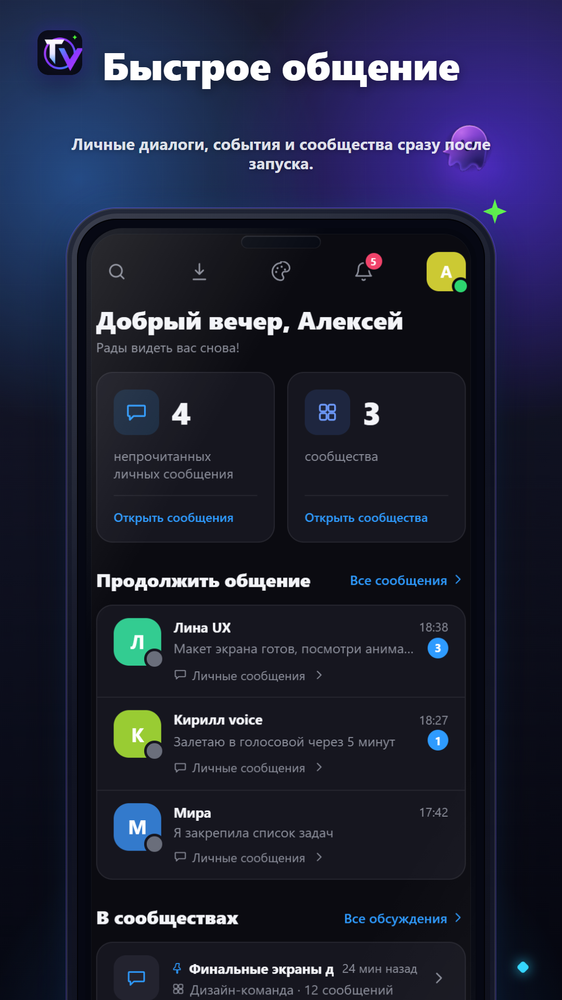
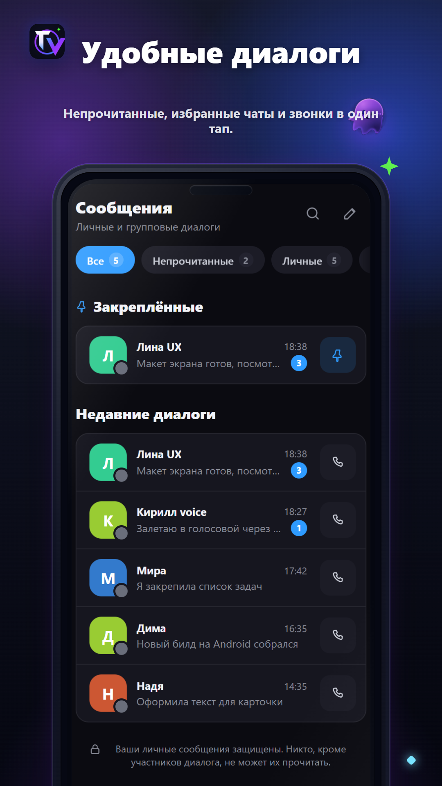
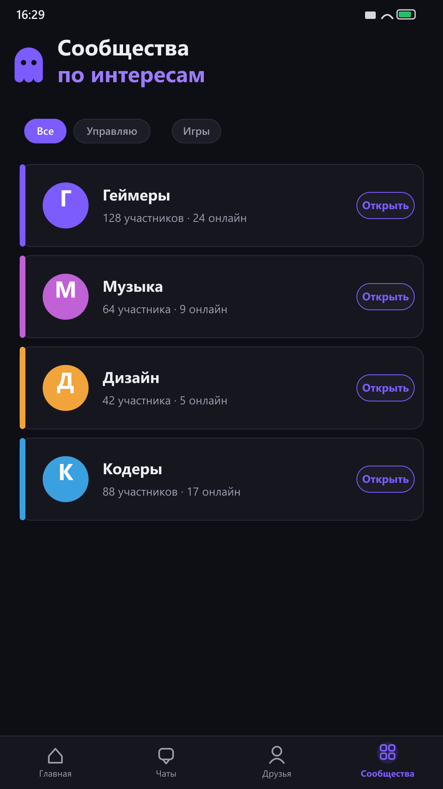
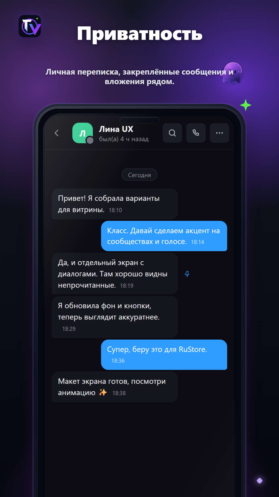
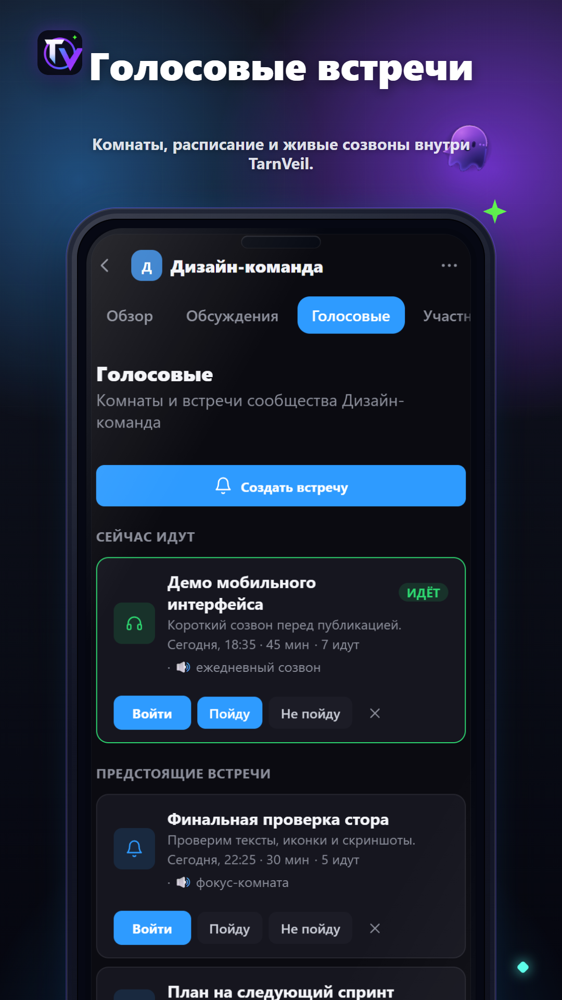

[Русский](README.md) · **English**

# TarnVeil

**A messenger for your own people** — end-to-end encrypted direct messages, voice and video calls, communities. One lightweight app.

&nbsp;

&nbsp;

---

## ✨ Features

- 💬 Direct messages with **end-to-end encryption (E2EE)**, plus group chats
- 🏘️ Communities with discussions, voice rooms, roles and moderation
- 🎧 Voice and video calls — one-on-one or the whole group: a call started from a group chat rings every member at once
- 🌐 Spatial audio rooms — how loud someone is depends on where they "stand"
- 🔇 **Our own noise suppression** — on desktop it reduces noise, including mouse and keyboard clicks, entirely on the device. Clicks over speech may remain; results depend on the microphone and environment. On phones the system handles audio
- 🎙️ Voice messages and round video messages
- 🧵 Discussions and threads inside communities
- 😀 Reactions, replies and pinned messages; select several messages at once to copy, forward or delete them
- 🌍 Message translation into the reader's language — on the device, without sending the text to third-party servers (in Chrome, Edge and the Windows app)
- 📎 Attachments up to 50 MB: images and files (encrypted on the device in direct messages)
- 🔔 Push notifications
- 🔑 Recovery code — forgot your password? You can get back into your account yourself, with your messages intact
- 🛡️ Blocking, reports, account deletion

The interface is available in Russian and English and follows your system language.

## 📥 Install

**🪟 Windows** — download the [installer](https://github.com/Amesu-afk/TarnVeil/releases/latest/download/TarnVeil-Tauri-Setup.exe) and run it. It is small — 6.8 MB: the app uses the browser engine built into Windows and updates itself. If SmartScreen appears, click "More info" → "Run anyway" (usual for apps without a publisher signature).

**🤖 Android** — tap **[Download for Android](https://amesu-afk.github.io/TarnVeil/)**:
1. Open the downloaded `.apk` file.
2. If Android asks, allow **installs from this source**.
3. If Play Protect warns you, make sure the APK came from the official TarnVeil page.
4. Install the app, open TarnVeil and create an account.

**🌐 Browser** — just open [tarnveil.ru](https://tarnveil.ru), nothing to install.

> TarnVeil is not on Google Play or the Microsoft Store yet, so the system may warn you during a manual install. Android 7.0 or newer, APK size ~4.0 MB.

## 🔐 Security and privacy

- **Direct messages are end-to-end encrypted** — the server stores only ciphertext and cannot read it on its own. Attachments in direct messages are encrypted on the device too.
- **Account recovery.** So that a forgotten password doesn't mean losing every conversation, the server keeps a copy of the key sealed to a separate administrator key whose private half is kept offline — a database leak alone does not expose messages. But the service operator, holding that key, can technically restore access — on the user's request and with a log entry. Details are in the [privacy policy](https://tarnveil.ru/en/privacy.html).
- Passwords are stored only as bcrypt hashes — the password itself is never saved.
- Voice and video calls are transmitted in real time and **are not recorded**.
- The app asks only for the permissions it needs: microphone and camera for calls, notifications, and installing updates. Updates are downloaded only from tarnveil.ru and checked against SHA-256 before installing. Attachments are picked through the system file dialog — the app does not ask for access to the whole phone storage.
- Official downloads: this page, [tarnveil.ru](https://tarnveil.ru), and the threads on [4PDA](https://4pda.to/forum/index.php?showtopic=1123988) and [Trashbox](https://trashbox.ru/topics/213245/tarnveil) (both in Russian). You can check the APK on VirusTotal; the SHA-256 of every build is listed in [Releases](https://github.com/Amesu-afk/TarnVeil/releases).
- 🔒 [Privacy policy](https://tarnveil.ru/en/privacy.html)

## 🧩 Open source

The messenger's own source code is closed, but its two least ordinary parts are published as separate repositories under Apache-2.0:

- **[tarnmedia](https://github.com/Amesu-afk/tarnmedia)** — the media server (a WebRTC SFU in Go on top of Pion) that carries every TarnVeil call and voice room. A small server with documented architecture and limitations.
- **[tarnveil-denoise](https://github.com/Amesu-afk/tarnveil-denoise)** — neural microphone noise suppression for the browser, with a model trained from scratch. Includes a compiled [npm package](https://www.npmjs.com/package/tarnveil-denoise) (`npm install tarnveil-denoise`) and a runnable recorder example. Hear model v54 on mixed, separately recorded speech and keyboard clicks: [demo](https://tarnveil.ru/en/remove-keyboard-noise.html).

## 📸 Screenshots

## 🔗 Links

- 🌐 Website and web app: [tarnveil.ru](https://tarnveil.ru) · [about TarnVeil in English](https://tarnveil.ru/en/about.html)
- 📥 Download page: [amesu-afk.github.io/TarnVeil](https://amesu-afk.github.io/TarnVeil/)
- 📦 All builds and release notes: [Releases](https://github.com/Amesu-afk/TarnVeil/releases)
- 🧩 Open parts: [tarnmedia](https://github.com/Amesu-afk/tarnmedia) (media server) · [tarnveil-denoise](https://github.com/Amesu-afk/tarnveil-denoise) (noise suppression)
- 🔒 [Privacy policy](https://tarnveil.ru/en/privacy.html)

---

© 2026 TarnVeil · a learning project · <a href="LICENSE">terms of use</a>

