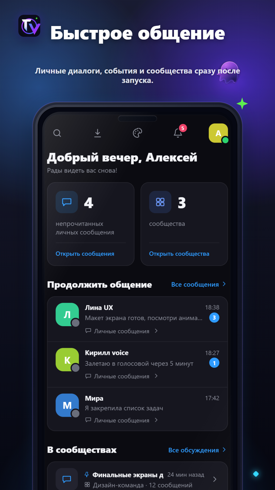
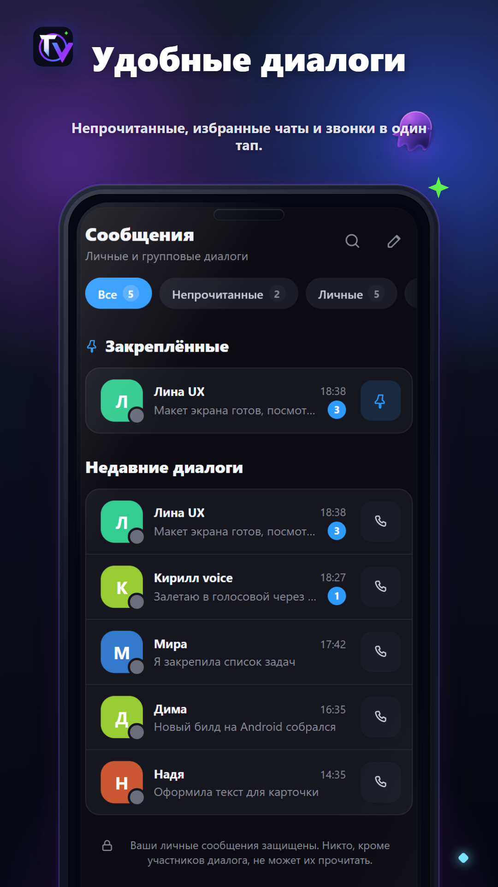
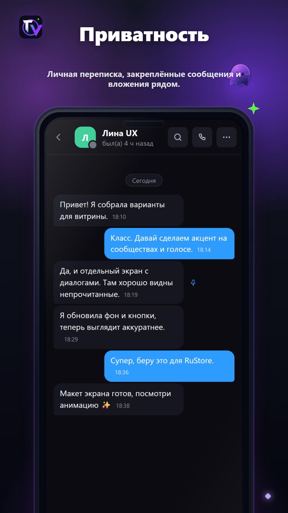
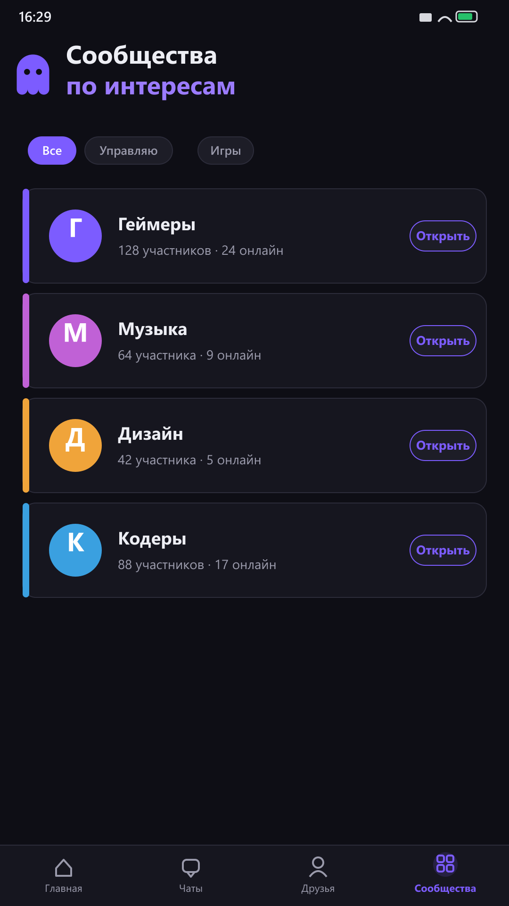
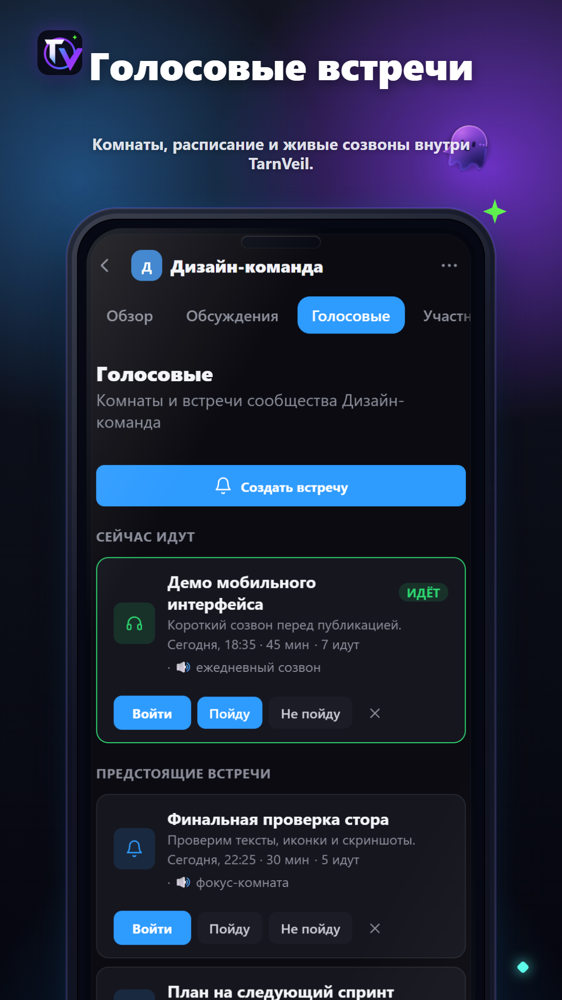

# 👻 TarnVeil

**Мессенджер для своих** — общение, голосовые и видеозвонки, сообщества. Всё в одном лёгком приложении.

&nbsp;

---

## ✨ Возможности

- 💬 Личные сообщения и групповые сообщества
- 🎧 Голосовые и видеозвонки
- 🧵 Обсуждения и темы внутри сообществ
- 📎 Вложения: картинки и файлы
- 🔔 Push-уведомления
- 🛡️ Блокировка и жалобы, удаление аккаунта

## 📲 Установка (Android)

1. Нажми **[Скачать для Android](https://amesu-afk.github.io/TarnVeil/)**.
2. Открой скачанный `.apk` файл.
3. Если Android попросит разрешение — включи **установку из этого источника**.
4. Если появится предупреждение Play Protect, проверь, что APK скачан с официальной страницы TarnVeil.
5. Установи приложение, открой TarnVeil и создай аккаунт.

> TarnVeil пока не опубликован в Google Play, поэтому Android может показывать предупреждение при установке APK вручную.

## 🔐 Безопасность

- APK публикуется только через официальный сайт и GitHub-репозиторий проекта.
- Приложение запрашивает только необходимые разрешения для работы звонков, уведомлений и вложений.
- Пароли хранятся в виде bcrypt-хеша.
- Голосовые и видеозвонки не записываются.
- Перед установкой APK можно проверить через VirusTotal.
- Рекомендуется скачивать APK только по ссылке из этого репозитория.

> Минимум Android 7.0. Размер ~5 МБ.

## 📸 Скриншоты

## 🔗 Ссылки

- 🌐 Сайт: [tarnveil.ru](https://tarnveil.ru)
- 🔒 [Политика конфиденциальности](https://tarnveil.ru/privacy.html)

---

© 2026 TarnVeil

