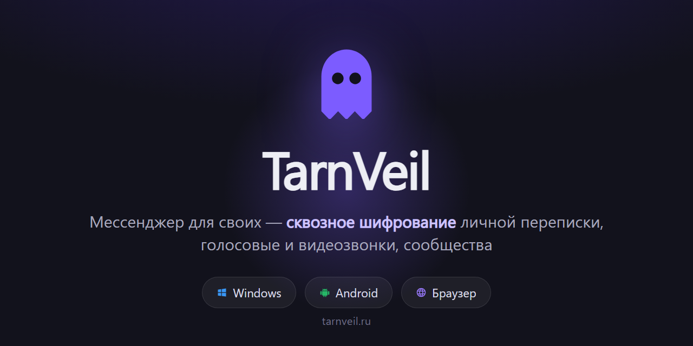
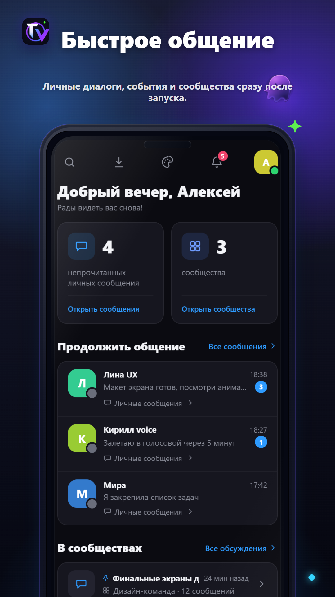
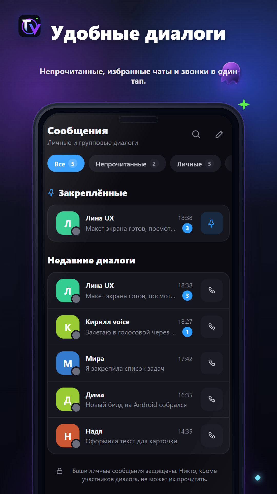
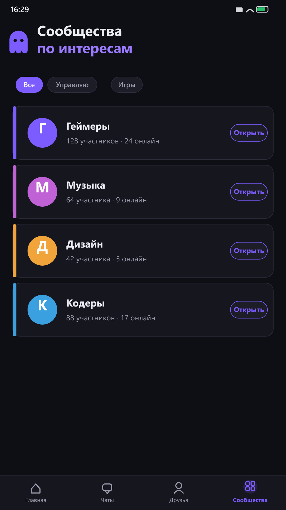
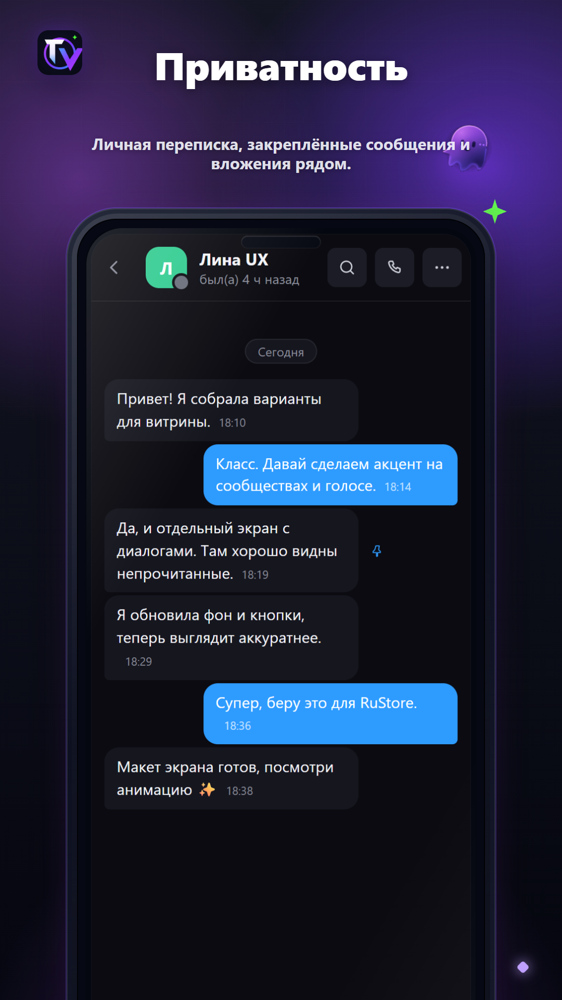
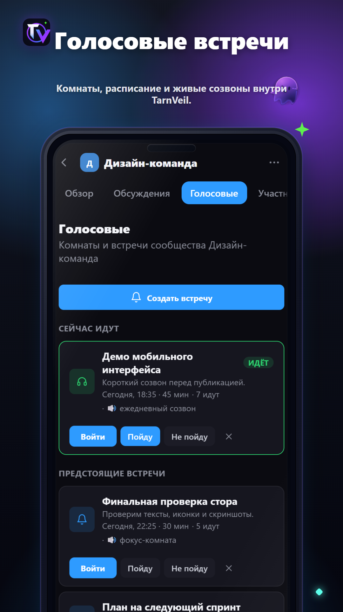

# 👻 TarnVeil

**Мессенджер для своих** — личные сообщения со сквозным шифрованием, голосовые и видеозвонки, сообщества. Всё в одном лёгком приложении.

&nbsp;

&nbsp;

---

## ✨ Возможности

- 💬 Личные сообщения со **сквозным шифрованием (E2EE)** и групповые чаты
- 🏘️ Сообщества с каналами, ролями и модерацией
- 🎧 Голосовые и видеозвонки — один на один и групповые
- 🌐 Пространственные аудио-комнаты — громкость собеседника зависит от того, кто где «стоит»
- 🔇 **Своё шумоподавление** — глушит щелчки мыши и клавиатуры прямо во время речи, целиком на устройстве
- 🎙️ Голосовые сообщения
- 🧵 Обсуждения и темы внутри сообществ
- 😀 Реакции, ответы и закреплённые сообщения
- 📎 Вложения: картинки и файлы (в личке шифруются на устройстве)
- 🔔 Push-уведомления
- 🛡️ Блокировка, жалобы, удаление аккаунта

## 📥 Установка

**🪟 Windows** — скачай [установщик](https://github.com/Amesu-afk/TarnVeil/releases/latest/download/TarnVeil-Tauri-Setup.exe) и запусти его. Установщик лёгкий — 6,7 МБ: приложение использует браузерный движок самой Windows и обновляется само. Если появится SmartScreen — «Подробнее» → «Выполнить в любом случае» (обычное для приложений без подписи издателя).

**🤖 Android** — нажми **[Скачать для Android](https://amesu-afk.github.io/TarnVeil/)**:
1. Открой скачанный `.apk` файл.
2. Если Android попросит — разреши **установку из этого источника**.
3. Если появится предупреждение Play Protect, убедись, что APK скачан с официальной страницы TarnVeil.
4. Установи приложение, открой TarnVeil и создай аккаунт.

**🌐 Браузер** — просто открой [tarnveil.ru](https://tarnveil.ru), устанавливать ничего не нужно.

> TarnVeil пока не опубликован в Google Play и Microsoft Store, поэтому система может предупреждать при ручной установке. Минимум Android 7.0, размер APK ~3,9 МБ.

## 🔐 Безопасность и приватность

- **Личная переписка защищена сквозным шифрованием (E2EE)** — сервер хранит только шифротекст и сам по себе не может её прочитать. Вложения в личке тоже шифруются на устройстве.
- **Восстановление доступа.** Чтобы забытый пароль не означал потерю всей переписки, на сервере лежит копия ключа, запечатанная на отдельный ключ администратора: его закрытая половина хранится офлайн, поэтому утечка базы сама по себе переписку не раскрывает. Но оператор сервиса, располагая этим ключом, восстановить доступ технически может — по обращению пользователя и с записью в журнал. Подробности — в [политике конфиденциальности](https://tarnveil.ru/privacy.html).
- Пароли хранятся только в виде bcrypt-хеша — сам пароль нигде не сохраняется.
- Голосовые и видеозвонки передаются в реальном времени и **не записываются**.
- Приложение запрашивает только необходимые разрешения: микрофон и камеру для звонков, уведомления, доступ к файлам для вложений.
- Официальные загрузки — только с этой страницы и с сайта [tarnveil.ru](https://tarnveil.ru); APK при желании можно проверить через VirusTotal.
- 🔒 [Политика конфиденциальности](https://tarnveil.ru/privacy.html)

## 📸 Скриншоты

## 🔗 Ссылки

- 🌐 Сайт и веб-версия: [tarnveil.ru](https://tarnveil.ru)
- 📥 Страница загрузки: [amesu-afk.github.io/TarnVeil](https://amesu-afk.github.io/TarnVeil/)
- 📦 Все сборки и что нового: [Releases](https://github.com/Amesu-afk/TarnVeil/releases)
- 🔒 [Политика конфиденциальности](https://tarnveil.ru/privacy.html)

---

© 2026 TarnVeil · учебный проект · <a href="LICENSE">условия использования</a>

