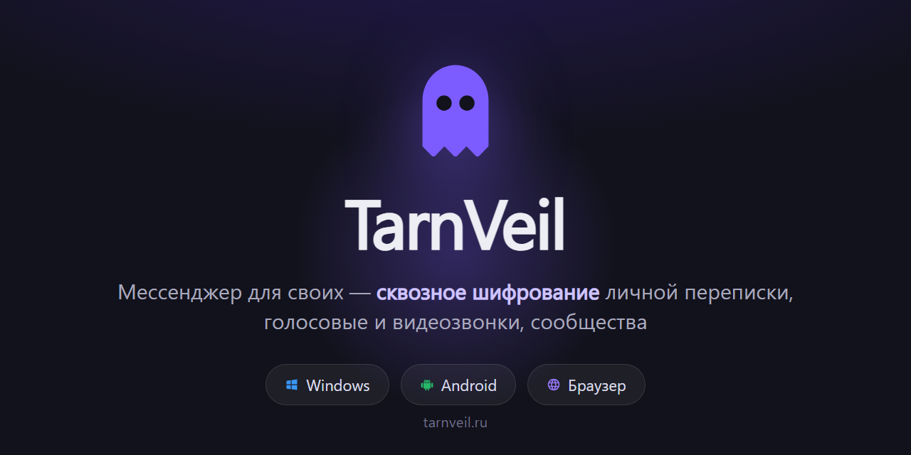

**Русский** · [English](README.en.md)

# 👻 TarnVeil

**Мессенджер для своих** — личные сообщения со сквозным шифрованием, голосовые и видеозвонки, сообщества. Всё в одном лёгком приложении.

&nbsp;

&nbsp;

---

## ✨ Возможности

- 💬 Личные сообщения со **сквозным шифрованием (E2EE)** и групповые чаты
- 🏘️ Сообщества с обсуждениями, голосовыми комнатами, ролями и модерацией
- 🎧 Голосовые и видеозвонки — один на один и всей группой: вызов из группового чата уходит всем участникам сразу
- 🌐 Пространственные аудио-комнаты — громкость собеседника зависит от того, кто где «стоит»
- 🔇 **Своё шумоподавление** — на компьютере уменьшает шум, включая щелчки мыши и клавиатуры, целиком на устройстве. Щелчки поверх речи могут оставаться; результат зависит от микрофона и окружения. На телефоне звуком управляет система
- 🎙️ Голосовые сообщения и видеосообщения-«кружки»
- 🧵 Обсуждения и темы внутри сообществ
- 😀 Реакции, ответы и закреплённые сообщения; можно выделить сразу несколько сообщений, чтобы скопировать, переслать или удалить
- 🌍 Перевод сообщений на язык читателя — прямо на устройстве, без отправки текста на сторонние серверы (в Chrome, Edge и приложении для Windows)
- 📎 Вложения до 50 МБ: картинки и файлы (в личке шифруются на устройстве)
- 🔔 Push-уведомления
- 🔑 Код восстановления — если пароль забыт, в аккаунт можно вернуться самому, и переписка останется на месте
- 🛡️ Блокировка, жалобы, удаление аккаунта

## 📥 Установка

**🪟 Windows** — скачайте [установщик](https://github.com/Amesu-afk/TarnVeil/releases/latest/download/TarnVeil-Tauri-Setup.exe) и запустите его. Установщик лёгкий — 6,8 МБ: приложение использует браузерный движок самой Windows и обновляется само. Если появится SmartScreen — «Подробнее» → «Выполнить в любом случае» (обычное для приложений без подписи издателя).

**🤖 Android** — нажмите **[Скачать для Android](https://amesu-afk.github.io/TarnVeil/)**:
1. Откройте скачанный `.apk` файл.
2. Если Android попросит — разрешите **установку из этого источника**.
3. Если появится предупреждение Play Protect, убедитесь, что APK скачан с официальной страницы TarnVeil.
4. Установите приложение, откройте TarnVeil и создайте аккаунт.

**🌐 Браузер** — просто откройте [tarnveil.ru](https://tarnveil.ru), устанавливать ничего не нужно.

> TarnVeil пока не опубликован в Google Play и Microsoft Store, поэтому система может предупреждать при ручной установке. Минимум Android 7.0, размер APK ~4,0 МБ.

## 🔐 Безопасность и приватность

- **Личная переписка защищена сквозным шифрованием (E2EE)** — сервер хранит только шифротекст и сам по себе не может её прочитать. Вложения в личке тоже шифруются на устройстве.
- **Восстановление доступа.** Чтобы забытый пароль не означал потерю всей переписки, на сервере лежит копия ключа, запечатанная на отдельный ключ администратора: его закрытая половина хранится офлайн, поэтому утечка базы сама по себе переписку не раскрывает. Но оператор сервиса, располагая этим ключом, восстановить доступ технически может — по обращению пользователя и с записью в журнал. Подробности — в [политике конфиденциальности](https://tarnveil.ru/privacy.html).
- Пароли хранятся только в виде bcrypt-хеша — сам пароль нигде не сохраняется.
- Голосовые и видеозвонки передаются в реальном времени и **не записываются**.
- Приложение запрашивает только необходимые разрешения: микрофон и камеру для звонков, уведомления и установку обновлений. Обновление скачивается только с tarnveil.ru и перед установкой сверяется по SHA-256. Файлы для вложений выбираются через системное окно — доступа ко всей памяти телефона приложение не просит.
- Официальные загрузки — эта страница, сайт [tarnveil.ru](https://tarnveil.ru), а также темы на [4PDA](https://4pda.to/forum/index.php?showtopic=1123988) и [Trashbox](https://trashbox.ru/topics/213245/tarnveil). APK при желании можно проверить через VirusTotal, а SHA-256 каждой сборки указан в [Releases](https://github.com/Amesu-afk/TarnVeil/releases).
- 🔒 [Политика конфиденциальности](https://tarnveil.ru/privacy.html)

## 🧩 Открытый код

Исходники самого мессенджера закрыты, но две самые нетривиальные его части вынесены в открытые репозитории под Apache-2.0:

- **[tarnmedia](https://github.com/Amesu-afk/tarnmedia)** — медиасервер (WebRTC SFU на Go и Pion), через который идут все звонки и голосовые комнаты TarnVeil. Небольшой сервер с описанием архитектуры и ограничений.
- **[tarnveil-denoise](https://github.com/Amesu-afk/tarnveil-denoise)** — нейросетевой шумодав микрофона для браузера, модель обучена с нуля. Есть готовый пакет для установки из GitHub и запускаемый пример. Послушать модель v54 на смеси отдельно записанных речи и щелчков: [демо на сайте](https://tarnveil.ru/keyboard-noise-demo.html).

## 📸 Скриншоты

## 🔗 Ссылки

- 🌐 Сайт и веб-версия: [tarnveil.ru](https://tarnveil.ru)
- 📥 Страница загрузки: [amesu-afk.github.io/TarnVeil](https://amesu-afk.github.io/TarnVeil/)
- 📦 Все сборки и что нового: [Releases](https://github.com/Amesu-afk/TarnVeil/releases)
- 🧩 Открытые части: [tarnmedia](https://github.com/Amesu-afk/tarnmedia) (медиасервер) · [tarnveil-denoise](https://github.com/Amesu-afk/tarnveil-denoise) (шумодав)
- 📱 Тема на [4PDA](https://4pda.to/forum/index.php?showtopic=1123988) · страница на [Trashbox](https://trashbox.ru/topics/213245/tarnveil)
- 🔒 [Политика конфиденциальности](https://tarnveil.ru/privacy.html)

---

© 2026 TarnVeil · учебный проект · <a href="LICENSE">условия использования</a>

